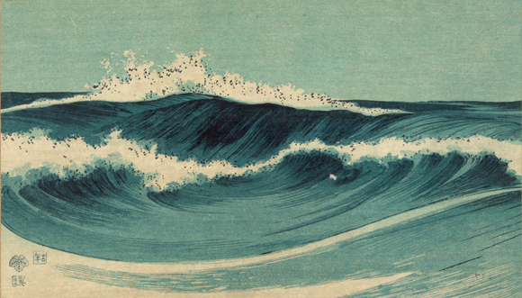

## New words

`agony`:
> agony的意思是“极大的痛苦”,这种痛苦可指肉体上的,也可指精神上的。强调
肉体上的痛苦时,指全身的、必须竭尽全力承受的痛苦; 强调精神上的痛苦时,常
用于描述临终、悔恨、失恋等。

doesn't mean `anger`

`evocation`:

> In most books, these `evocations` of summertime ease and sweet
  familial conviviality would be a pleasure.
  
n. 引起；唤起；<古> 召唤；招魂

more often it implies the `evocation` of profound, agitating, but
usually agreeable, emotion.

`Euripides`:

n. 欧里庇得斯(希腊的悲剧诗人)

> Just talking about the works of Aeschylus, Euripides and Sophocles,
  you cannot even say that you have attained half of their achivements already.

## Good sentences

* The first is about the stunned horror of a woman who lost, in one
  moment, her past, present, and future.

* Grief is a frightening condition, and at its extreme is like the
  sun: impossible to look at directly.
  
*  Grief and rage - you need to contain that, to put a frame around
  it, where it can play itself out without you or your kin having to
  die. There is a theory that watching unbearable stories about other
  people lost in grief and rage is good for you - may cleanse you of
  darkness. Do you want to go down to the pits of yourself all alone?
  Not much. What if an actor could do it for you? Isn't that why they
  are called actors? They act for you. [1]
  
* Writing is a much better quality of agony than trying to forget.

## Comment

nothing, so sad a story.

[1] Anne Carson, introduction to Grief Lessons.
